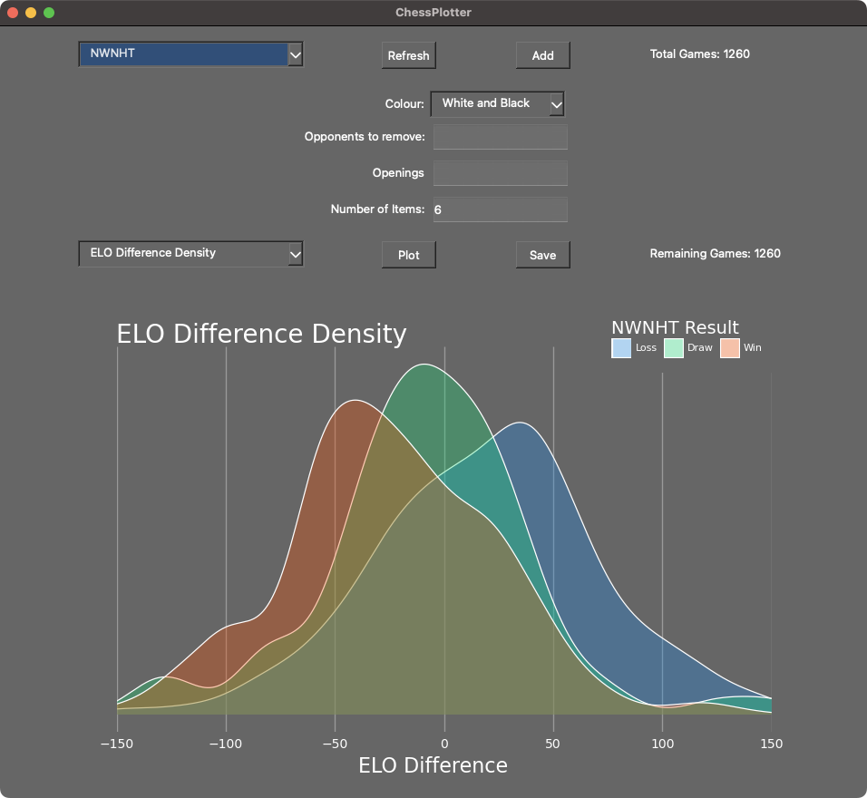
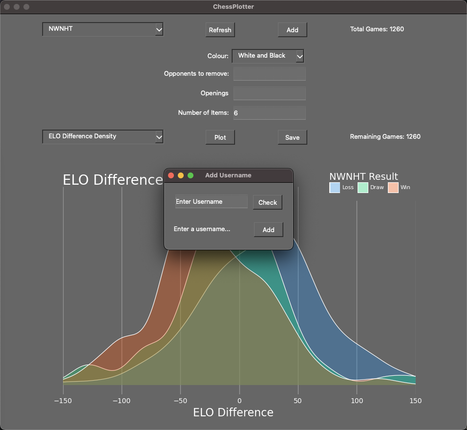

# Chess Plotter
A Python app to request Chess.com game data and generate plots

#### Installation

requirements:
matplotlib
numpy
pandas
Pillow
plotnine
PyQt

#### Installation
Creating conda environment:
	conda create -n env_chess_testing python=3.9.12

Installing packages:
	pip install chess.com numpy matplotlib pandas plotnine pyarrow PyQt6 
or 
	pip install -r requirements.txt

Repository comes prepared with all required directories but if using in another directory/environment then paths may have to be updated.

Running:
	python src/ChessPlotter.py

#### Use
Running the app for the first time will pull up the _Add User_ window in order to add a user and give the app some data to read.[Note: If the _Add User_ window is closed before a user is added then the application will close]

To add a user, enter the chess.com username into the field, then use the 'Check' button to check that the username was correctly entered.  Once a username has been checked then it the 'Add' button can be used to query for all of the files.  This will take a while, especially for players with lots of games or games from many months.

Then additional users can be added or the window can be closed to begin plotting.

Plots can be generated with the following flow:
1. Select a user.
- Click 'Refresh' to download latest data if not done recently
2. Apply filters to the data.
- Player colour: The playing colour of the selected player
- Opponents to Remove: Write a space separated list of chess.com usernames to filter out of data.
- Openings: Write a space separated list of ECO opening codes to filter by
- Number of Items: Some plots use this as a parameter(like number of openings to include)
3. Select the type of plot to be displayed.
4. Click 'Plot' button for the plot to be generated.
5. Click 'Save' button to open file save window for the plot.

This process can be repeated beginning at any step or additional chess.com player data can be downloaded and processed using the 'Add' button to open the _Add User_ window.  The application can be closed using the window close button.

#### Interface

#### Example Plots
Below are a couple images of sample plots, more are available in the docs/sample_plots directory.

